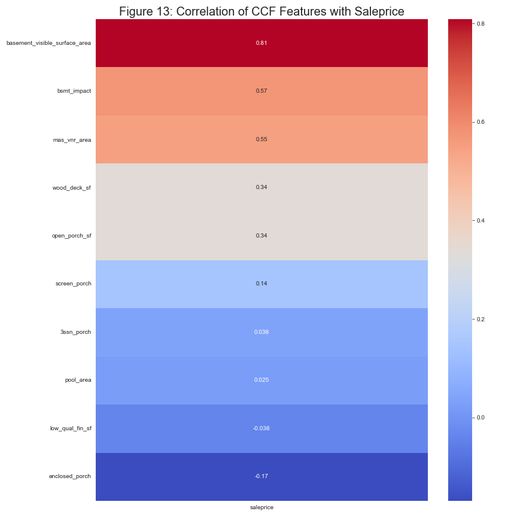

# Project 2: Regression Analysis of Conspicuous Consumption Factors in the Ames, Iowa Housing Market
**DSI-822 - General Assembly**

**Graham Waters**

## Problem Statement -
An Airbnb investor approached our company with a proposal to purchase one or more houses to rent out in Ames, Iowa. They have their eye on several key neighborhoods in Ames which will form the basis for this study. Therefore, we postulate that an analysis of surrounding factors is in the client's best interest. With this in mind, we are performing a regression analysis to determine which conspicuous consumption [1] features (`CCFs`), commonly referred to as 'keeping up with the joneses', are most influential or noteworthy in determining the market value of a house (as of 2010) in these neighborhoods in Ames, Iowa.

# Target Metrics
* R2 value
* RMSE value

# Defining the conditions for a `success`

What we would consider successful is a model that can predict the sale price of a house in Ames, Iowa, with an R2 score of `0.7` or greater. This would indicate that 70% of the variance in the sale price of a house in Ames, is attributable to these CCF characteristics. We would also like to see an RMSE value of `40,000` or less.


# Feature Engineering and Selection
Before getting into data cleaning and feature engineering, we need to decide on the direction that we will take with our analysis. We have a few options. When we consider conspicuous features, these are things that a person can see while driving by. This effectively removes variables that are not visible to the naked eye.

*caveats*: The bsmt_exposure feature is useful. We will transform this into an ordinal, which indicates how exposed the basement is (and then weight the basement columns according to their exposure).
* Gd - Good Exposure - 1
* AV - Average Exposure (split levels or foyers typically score average or above) - 0.66
* Mn - Minimum Exposure - 0.33
* No - No Exposure - 0

# Data Cleaning and Feature Engineering


In real estate, the phrase "the jones effect" describes home price escalation, or a homeowner's likelihood to sell increasing due to an adjacent neighbor selling their home. Having worked in Real Estate, I was drawn to this idea as a potential solution to our client's posed situation. There are several key features in the data that specifically interested me with this phenomenon in mind.
1. `Neighborhood` - One of several neighborhoods in Ames.
2. `House Style` - 2 story vs 1 story
3. `Year Built` (and Year Remodeled) - The age of the house and the last time it was remodeled.
1. If the remodel year is the same as the year built, then the house has not been remodeled.
4. `overall_qual` (Overall Quality) - The house's overall quality.
5. `exter_qual` (and exter_cond) - The quality of the exterior of the house.
6. `exterior_1st` (the type of exterior material)
7. `exterior_2nd` (just in case the exterior material is different on the second floor)
8. `lot_shape` (the shape of the lot)
9. `lot_area` (the size of the lot)
10. `exter_qual` (which is essentially the same thing as exter_cond)
11. `street` (paved or gravel)
12. `lot_frontage` (the amount of frontage on the lot)
13. `roof_style` (the style of the roof)
14. `roof_matl` (the material of the roof)
15. `mas_vnr_type` (the type of masonry veneer)
16. `mas_vnr_area` (the area of the masonry veneer)

These factors (or features) were the spearhead of my analysis of whether I could predict a home's sale price based on features that were not explicitly available in the sample data set provided by Kaggle.

## Data

### Features in the Ames Dataset that were not used in the analysis:
* `PID` - Parcel identification number
* Justification: This is a unique identifier for each house in the dataset. It is not a feature that can be used to predict the sale price of a house.


### Features in the Ames Dataset that were used in the analysis:

In real estate, the phrase "the jones effect" describes home price escalation, or a homeowner's likelihood to sell increasing due to an adjacent neighbor selling their home. Having worked in Real Estate, and with Realtors I was drawn to this idea as a potential solution to our client's posed situation. There are several key features in the data that specifically interested me with this phenomenon in mind.

### Which Features will be visible to Neighbors?
* Wood Deck SF, Open Porch SF, Enclosed Porch, 3Ssn Porch, Screen Porch, Pool Area, Pool QC, Fence.
* Justification: These features are visible to neighbors and are therefore considered `CCFs`.
* The square footage of the above-ground structure is a visual factor that will be considered. This includes the following features: Gr Liv Area, 1st Flr SF, 2nd Flr SF, Low Qual Fin SF, and Garage Area.
* For further research, we recommend an analysis of any features that could be observed through social media or other online sources that may impact sale price CCFs. This could include the kitchen, bathroom, and other elements visible in photos. Unfortunately, such a deep dive is beyond the scope of this study.
* The materials used to construct the outside of the house are visible and will be included. This includes the following features: Exterior 1st, Exterior 2nd, Mas Vnr Area, and Mas Vnr Type.
* if possible we will assign higher weights to exterior features on the house's second story. This is because the second story is more visible to neighbors than the first story.
* The final factors that will be considered are `the year the house was built` and the year the house was remodeled. This includes the following features: Year Built, Year Remod/Add, and Yr Sold.

### To Summarize: The CCFs that were used in the analysis are:
* `lot_area`
* `garage_type`
* `garage_yr_blt`
* `garage_finish`
* `garage_area`
* `garage_qual`
* `garage_cond`
* `kitchen_qual`
* `wood_deck_sf`
* `open_porch_sf`
* `enclosed_porch`
* `3ssn_porch`
* `screen_porch`
* `pool_area`
* `fireplace_qu`
* `gr_liv_area`
* `1st_flr_sf`
* `2nd_flr_sf`
* `low_qual_fin_sf`
* `exterior_1st`
* `exterior_2nd`
* `mas_vnr_area`
* `mas_vnr_type`
* `year_built`
* `year_remod/add`
* `yr_sold`
* `bsmt_exposure`

### Engineered Features:
* `bsmt_impact` - From `bsmt_exposure` and `bsmt_cond` (basement exposure and basement condition)
* `basement_volume` - From `bsmtfin_sf_1` and `bsmtfin_sf_2` (basement finished square feet 1 and basement finished square feet 2)
* `basement_visible_surface_area` - From `bsmtfin_sf_1` and `bsmtfin_sf_2` (basement finished square feet 1 and basement finished square feet 2)
* `structure_square_footage` - From `1st_flr_sf` and `2nd_flr_sf` (first floor square feet and second floor square feet)

# Data Dictionary (of included features)

|Feature|Type|Dataset|Description|Engineered|NA Meaning|
|:-|:-|:-|:-|:-|:-|
|`lot_area`|int|train/test|Lot size in square feet|No||
|`garage_type`|object|train/test|Garage location|No|NA|
|`garage_yr_blt`|float|train/test|Year garage was built|No|NA|
|`garage_finish`|object|train/test|Interior finish of the garage|No|NA|
|`garage_area`|float|train/test|Size of garage in square feet|No|NA|
|`garage_qual`|object|train/test|Garage quality|No|NA|
|`garage_cond`|object|train/test|Garage condition|No|NA|
|`kitchen_qual`|object|train/test|Kitchen quality|No|NA|
|`wood_deck_sf`|int|train/test|Wood deck area in square feet|No|NA|
|`open_porch_sf`|int|train/test|Open porch area in square feet|No|NA|
|`enclosed_porch`|int|train/test|Enclosed porch area in square feet|No|NA|
|`3ssn_porch`|int|train/test|Three season porch area in square feet|No|NA|
|`screen_porch`|int|train/test|Screen porch area in square feet|No|NA|
|`pool_area`|int|train/test|Pool area in square feet|No|NA|
|`fireplace_qu`|object|train/test|Fireplace quality|No|NA|
|`gr_liv_area`|int|train/test|Above grade (ground) living area square feet|No||
|`1st_flr_sf`|int|train/test|First Floor square feet|No||
|`2nd_flr_sf`|int|train/test|Second floor square feet|No||
|`low_qual_fin_sf`|int|train/test|Low quality finished square feet (all floors)|No||
|`exterior_1st`|object|train/test|Exterior covering on house|No|NA|
|`exterior_2nd`|object|train/test|Exterior covering on house (if more than one material)|No|NA|
|`mas_vnr_area`|float|train/test|Masonry veneer area in square feet|No|NA|
|`mas_vnr_type`|object|train/test|Masonry veneer type|No|NA|
|`year_built`|int|train/test|Original construction date|No||
|`year_remod/add`|int|train/test|Remodel date (same as construction date if no remodeling or additions)|No||


## A Table for the Basement Features Only

|Feature|Type|Description|Meaning of NA|
|:-|:-|:-|:-|
|Bsmt Qual|object|Evaluates the height of the basement|No Basement|
|Bsmt Cond|object|Evaluates the general condition of the basement|No Basement|
|Bsmt Exposure|object|Refers to walkout or garden level walls||
|BsmtFin Type 1|object|Rating of basement finished area|No Basement|
|BsmtFin SF 1|float64|Type 1 finished square feet|No Basement|
|BsmtFin Type 2|object|Rating of basement finished area (if multiple types)|No Basement|
|BsmtFin SF 2|float64|Type 2 finished square feet|No Basement|
|Bsmt Unf SF|float64|Unfinished square feet of basement area|No Basement|
|Total Bsmt SF|float64|Total square feet of basement area|No Basement|

Strangely enough, the height of the basement is named `basement_qual`.
When applied, this feature will cancel out any basement features that are not exposed to the outside.

# List of Engineered Features
1. `basement_presence` - This feature is an impact measure. It takes from the numerical values I assigned to the `bsmt_exposure` feature and multiplied it by the `total_bsmt_sf` feature. This gives us a measure of the impact that the basement has on the sale price of the house.
2. `basement_volume` - This feature is an impact measure. It finds the total volume of the basement by multiplying the `bsmt_qual` feature by the `total_bsmt_sf` feature. This gives us a measure of the impact that the basement has on the sale price of the house.
3. `basement_visible_surface_area` - The visible portion of the basement by rough estimate. Calculated by multiplying the `bsmt_exposure` feature by the `total_bsmt_sf` feature. This gives us a measure of the impact that the basement has on the sale price of the house.
4. `structure_square_footage` - The total square footage of the structure. This is the sum of the basement square footage and the first-floor and second-floor square footage. This gives us a measure of the structure's impact on the house's sale price.

### Dropping The Base Features
To keep the data from being intercorrelated, I will drop the following features (that were used to create the features above):
* `bsmt_exposure`
* `bsmtfin_sf_1`
* `bsmtfin_sf_2`
* `1st_flr_sf`
* `2nd_flr_sf`
* `bsmt_qual`
* `total_bsmt_sf`


# Interpretation of Missing Values in the data
* `bsmt_exposure` - This feature is a categorical feature that describes the exposure of the basement to the outside. The missing values are likely due to the fact that the house does not have a basement.
* `bsmtfin_sf_1` - This feature is a numerical feature that describes the square footage of the first finished basement. The missing values are likely due to the fact that the house does not have a basement.
* `bsmtfin_sf_2` - This feature is a numerical feature that describes the square footage of the second finished basement. The missing values are likely due to the fact that the house does not have a basement.
* `bsmt_unf_sf` - This feature is a numerical feature that describes the square footage of the unfinished basement. The missing values are likely due to the fact that the house does not have a basement.
* `total_bsmt_sf` - This feature is a numerical feature that describes the total square footage of the basement. The missing values are likely due to the fact that the house does not have a basement.
* `bsmt_qual` - This feature is a categorical feature that describes the height of the basement. The missing values are likely due to the fact that the house does not have a basement.
* `bsmt_cond` - This feature is a categorical feature that describes the condition of the basement. The missing values are likely due to the fact that the house does not have a basement.
* `bsmtfin_type_1` - This feature is a categorical feature that describes the type of the first finished basement. The missing values are likely due to the fact that the house does not have a basement.
* `bsmtfin_type_2` - This feature is a categorical feature that describes the type of the second finished basement. The missing values are likely due to the fact that the house does not have a basement.
* `garage_type` - This feature is a categorical feature that describes the location of the garage. The missing values are likely due to the fact that the house does not have a garage.
* `garage_yr_blt` - This feature is a numerical feature that describes the year the garage was built. The missing values are likely because the house does not have a garage.
* `garage_finish` - This feature is a categorical feature that describes the interior finish of the garage. The missing values are likely because the house does not have a garage.
* `garage_cars` - This feature is a numerical feature that describes the size of the garage in car capacity. The missing values are likely because the house does not have a garage.
* `garage_area` - This feature is a numerical feature that describes the size of the garage in square feet. The missing values are likely due to the fact that the house does not have a garage.
* `garage_qual` - This feature is a categorical feature that describes the garage quality. The missing values are likely due to the fact that the house does not have a garage.
* `garage_cond` - This feature is a categorical feature that describes the garage condition. The missing values are likely since the house does not have a garage.
* `mas_vnr_area` - This feature is a numerical feature that describes the area of the masonry veneer. The missing values are likely due to the fact that the house does not have a masonry veneer.
* `mas_vnr_type` - This feature is a categorical feature that describes the type of the masonry veneer. The missing values are likely since the house does not have a masonry veneer.
* `fireplace_qu` - This feature is a categorical feature that describes the quality of the fireplace. The missing values are likely because the house does not have a fireplace.
* `lot_frontage` - This feature is a numerical feature that describes the linear feet of the street connected to the property. The missing values are likely since the house does not have a street connected to it.
* `alley` - This feature is a categorical feature that describes the type of alley access to the property. The missing values are likely due to the fact that the house does not have alley access.
* `fence` - This feature is a categorical feature that describes the quality of the fence. The missing values are likely due to the fact that the house does not have a fence.
* `pool_qc` - This feature is a categorical feature that describes the quality of the pool. The missing values are likely due to the fact that the house does not have a pool.
* `misc_feature` - This feature is a categorical feature that describes the miscellaneous feature not covered in other categories. The missing values are likely due to the fact that the house does not have a miscellaneous feature.

# Correlation of Features

The table below shows a preview of our retained data.

|record | lot_area | garage_type | garage_yr_blt | garage_finish | garage_area | garage_qual | garage_cond | kitchen_qual | wood_deck_sf | open_porch_sf | enclosed_porch | 3ssn_porch | screen_porch | pool_area | fireplace_qu | gr_liv_area | 1st_flr_sf | 2nd_flr_sf | low_qual_fin_sf | exterior_1st | exterior_2nd | mas_vnr_area | mas_vnr_type | year_built | year_remod/add | yr_sold | bsmt_exposure | bsmt_impact | basement_volume | basement_visible_surface_area | structure_square_footage | saleprice | |
|---|---|---|---|---|---|---|---|---|---|---|---|---|---|---|---|---|---|---|---|---|---|---|---|---|---|---|---|---|---|---|---|---|---|
| 1 | 11492 | Attchd | 1997.0 | RFn | 559.0 | TA | TA | Gd | 0 | 74 | 0 | 0 | 0 | 0 | TA | 2122 | 913 | 1209 | 0 | VinylSd | VinylSd | 132.0 | BrkFace | 1996 | 1997 | 2009 | 0.0 | 0.0 | 3652.0 | 913.00 | 3035.0 | 220000 |
| 2 | 7922 | Detchd | 1953.0 | Unf | 246.0 | TA | TA | Gd | 0 | 52 | 0 | 0 | 0 | 0 | NaN | 1057 | 1057 | 0 | 0 | VinylSd | VinylSd | 0.0 | None | 1953 | 2007 | 2010 | 0.0 | 0.0 | 3171.0 | 792.75 | 2114.0 | 109000 |
| 3 | 9802 | BuiltIn | 2007.0 | Fin | 400.0 | TA | TA | TA | 100 | 0 | 0 | 0 | 0 | 0 | NaN | 1444 | 744 | 700 | 0 | VinylSd | VinylSd | 0.0 | None | 2006 | 2007 | 2010 | 0.0 | 0.0 | 1536.0 | 384.00 | 1828.0 | 174000 |
| 4 | 14235 | Detchd | 1957.0 | Unf | 484.0 | TA | TA | TA | 0 | 59 | 0 | 0 | 0 | 0 | NaN | 1445 | 831 | 614 | 0 | Wd Sdng | Plywood | 0.0 | None | 1900 | 1993 | 2010 | 0.0 | 0.0 | 1352.0 | 338.00 | 2121.0 | 138500 |
| 5 | 16492 | Attchd | 1966.0 | Fin | 578.0 | TA | TA | Gd | 0 | 0 | 0 | 0 | 0 | 0 | Gd | 1888 | 1888 | 0 | 0 | BrkFace | Plywood | 0.0 | None | 1966 | 2002 | 2010 | 0.0 | 0.0 | 4551.0 | 1137.75 | 3405.0 | 190000 |

# What kinds of Distributions do we have?

**Figure 9. Distribution of Variables**


In Figure 9, we can see that the distribution of the target variable, `saleprice`, is skewed to the right. This is a common distribution for the target variable in a regression problem. We can also see that the distribution of the features `basement_volume`, `basement_visible_area`, `structure_square_footage`, and the garage, lot and general living areas, are also skewed to the right. This is a common distribution for the features in a regression problem.

# Dealing with Distribution Issues
1. The `structure_square_footage` feature had an outlier where the house had 334 sqft. After removing this outlier, the distribution of the feature was more normal, as shown in the figure below.


2. Lot frontage had some outliers that were removed. The distribution of the feature was more normal, as shown in the figure below.


# Correlation of Features

The figure below shows the correlation of the features in the data.


Features that were used to engineer other features were ultimately dropped because they resulted in multicollinearity.


This resulted in the high correlations you can see in the figure below.




### Inferences from our Linear Regression Model Coefficients


# Results of Regression Models

## Linear Regression
A one unit increase in `open_porch_sf`, holding all other features constant, will result in a 180.73700801557527 increase in saleprice.
A one unit decrease in `bsmt_impact`, holding all other features constant, will result in a 7.648236639702077 increase in `saleprice`.


The residuals plot is shown below.


## LASSO Regression

The LASSO regression model achieved an R2 score of 0.811 on the train set and 0.817 on the test set with a cross-validation score of 79.82 %. This means that roughly 81.1 % of the variability in the features was able to be explained by our target `saleprice`.


As shown in the figure above, the Lasso model was fairly good at predicting the price.

[](blob:vscode-webview%3A//1fpm0a83lvv4tscult059s5bt6u0146loc62r32d5fsa76h3m3ec/c01a074d-73db-447e-acb9-34087a5b8c36)

The residual plot is shown below.


### Inference from LASSO Regression

* A one-unit increase in basement_visible_surface_area, holding all other features constant, will result in a 48228.697768823506 log-unit increase in saleprice.
* A one-unit decrease in bsmt_impact, holding all other features constant, will result in a 7516.984753259642 log-unit increase in saleprice.


## Ridge Regression

The ridge regression usually used to prevent overfitting [3] was not as useful for this.


The residual plot is shown below.


### Inference on Ridge Regression Coefficients

* A one-unit increase in structure_square_footage, holding all other features constant, will result in a 37477.54996845295 log-unit increase in saleprice.
* A one-unit decrease in wood_deck_sf, holding all other features constant, will result in a 3684.8200156374287 log-unit increase in saleprice.

## ElasticNet Regression
Our elastic net model was not as good as the Lasso model. It achieved an R2 score of 0.790 on the train set and 0.797 on the test (validation) set, with a cross-validation score of 78.09 %. This means that roughly 79 % of the variability in the features was able to be explained by our target `saleprice`.


The residual plot is shown below. These values represent how far from the line of best fit the data points are. The residuals should be normally distributed around 0. This is not the case here.


There is clear evidence of heteroscedasticity as the data is dense on the left-hand side and fans out to the right. This is a sign that the model is not a good fit for the data.

### Inference on the ElasticNet Coefficients

* A one-unit increase in basement_visible_surface_area, holding all other features constant, will result in a 30536.155106619084 log-unit increase in saleprice.
* A one-unit decrease in wood_deck_sf, holding all other features constant, will result in an 8405.953132852997 log-unit increase in saleprice.
# Final Plots and Conglomerate Model Visualizations


Finally, we compare the four models using a scatter plot of the actual vs. predicted values. The Lasso model is the best fit for the data.


The coeficients for the models are shown below.


# Suggestions for Further Research

A log transformation of the saleprice could reduce the heteroscedasticity of the data.
```python
#* Replacing the Neighborhoods: 'Grmhill' and 'Landmrk' with the mode of the neighborhood column. There are very few houses in these neighborhoods, and they are not representative of the data.

train['neighborhood'].replace('GrnHill', train['neighborhood'].mode()[0], inplace=True) # StoneBr
train['neighborhood'].replace('Landmrk', train['neighborhood'].mode()[0], inplace=True)
```

# Conclusions and Final Remarks
Based on the results of this regression analysis, we can conclude that the following features are the most important in predicting the sale price of a house in Ames, Iowa.

* `overall_qual`
* `gr_liv_area`
* `garage_area`
* `total_bsmt_sf`
* visible basement surface area is one CCF that did show some correlation to higher home prices.

We recommend that our client take time and focus on the mentioned features to find the ideal property to purchase. We did not hit our desired benchmarks for model prediction given the variables that we chose; however we were able to develop a predictive model using only publicly available information about a home's features. This allows us to make predictions based solely on the public record without spending any money or effort to gather more data ourselves. In addition to being cost-effective, it also provides a quick solution to identify properties that may be worth purchasing. Our model shows some promise; however, we would like to investigate whether there is anything else that could improve its performance. For example, perhaps we can use machine learning techniques such as boosting to predict the sale price better.
To continue improving our model, we plan to run the same regression analysis on additional data sets. Ames rental data is an exciting area for further study, and we are considering recommending this to our clients as a way to see an ROI on their investment quicker than with the purchase market. Additionally, we believe that adding additional features to our model might help us achieve even higher accuracy rates.


# Supplemental Materials
See the following links for supplemental materials.
[additional functions for further analysis](scripts/01_functions.py)


## Authors

- [@grahamwaters](https://www.github.com/icehelmetminer)


## 🚀 About Me

    👋 My name is Graham Waters, and I am passionate about using Data for Good.
    👀 I’m interested in machine learning, Reinforcement Model Training, NLP, deep analysis, computer vision with Convolutional neural networks, and any kind of data visualization
    🌱 I’m currently focusing on the Python language for my projects with some deviation into R and d3.
    💞️ I’m looking to collaborate on text linguistics analysis or anything Artificial Intelligence related.
    📫 Reach me through my linkedin at https://www.linkedin.com/in/grahamwatersdatascientist/

## Works Cited

[1] Conspicuous consumption. (2022, July 7). In Wikipedia. https://en.wikipedia.org/wiki/Conspicuous_consumption

[2] De Cock, Dean. "Ames, Iowa: Alternative to the Boston housing data as an end of semester regression project." Journal of Statistics Education 19.3 (2011).

[3] https://www.python-graph-gallery.com/web-ggbetweenstats-with-matplotlib


## Appendix

A. FHA/HUD guideline (Handbook 4150.2) states: Gross Living Area is the total area of finished, above-grade residential space.  It is calculated by measuring the outside perimeter of the structure and includes only finished, habitable, above-grade living space.  Finished basements and unfinished attic areas are not included in total gross living area.  The appraiser must match the measurement techniques used for the subject to the comparable sales.  It is important to apply this measurement technique and report the building dimensions consistently because failure to do so can impair the quality of the appraisal report.

The Fannie Mae Selling Guide is very clear on what is a basement or below grade stating:  A level is considered below-grade if any portion of it is below-grade—regardless of the quality of its finish or the window area of any room.  A walk-out basement with finished rooms would not be included in the above-grade room count.

Fannie Mae also specifically recognizes that all basements are not created equal and states: Rooms that are not included in the above-grade room count may add substantially to the value of a property—particularly when the quality of the finish is high. The appraiser must report the basement or other partially below-grade areas separately and make appropriate adjustments for them on the “basement and finished areas below-grade” line in the “sales comparison analysis” grid.

The ERC guideline is more nuanced than Fannie Mae, FHA/HUD and ANSI in below grade living areas as it states:  When areas that are 50 percent or more above grade are fully finished and equipped with a design and arrangement of windows adequate to provide the “look and feel” of an above-grade-living area, the appraiser can opt to include these areas in the gross living area calculation.

Attics, Lofts & Low Ceilings

The ANSI guideline states: To be included in finished square footage calculations, finished areas must have a ceiling height of at least 7 feet (2.13 meters) except under beams, ducts, and other obstructions where the height may be 6 feet 4 inches (1.93 meters); under stairs where there is no specified height requirement; or where the ceiling is sloped.  If a room's ceiling is sloped, at least one-half of the finished square footage in that room must have a vertical ceiling height of at least 7 feet (2.13 meters); no portion of the finished area that has a height of less than 5 feet (1.52meters) may be included in finished square footage.

The Fannie Mae Selling Guide does not specifically identify any requirements for inclusion of finished attic spaces or ceiling heights.

The ERC guideline also states: If a room, which meets Guideline #5 and should be included in GLA, has a sloping ceiling, the appraiser should consider the 5-foot height rule for calculating livable space.  Included in the calculation would be only that floor area for which there is a vertical distance of 5 or more feet between floor and ceiling.  It is noted however, that ERC #5 also states:  The utility of finished attic areas frequently differs from that of main-level living areas due to differences in accessibility and energy efficiency.  Thus, the contributory value can differ substantially from that of main-level living areas.  In order to deal with this situation more effectively, this guideline states that attic areas (finished or unfinished) are not to be included in gross living area calculations.

source: http://nationalappraiserroster.com/Resources/Appraising101/UnderstandingMeasurementsRoomCounts/tabid/223/Default.aspx
